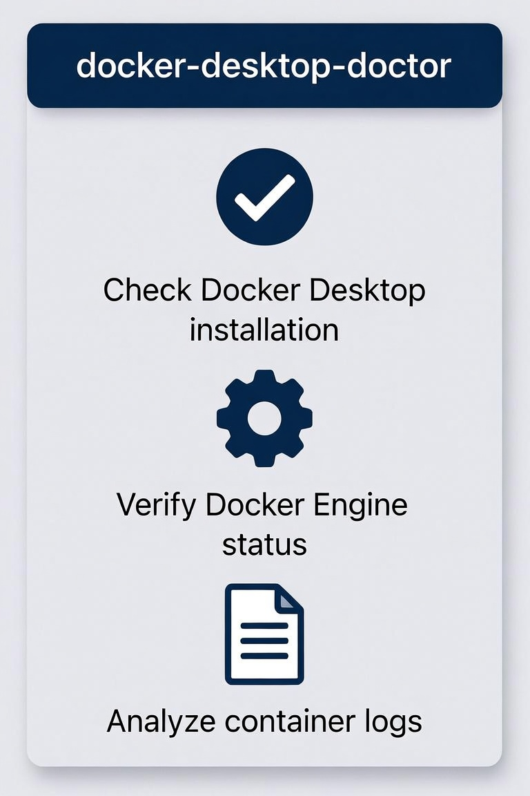

# docker-desktop-doctor

**Docker Desktop ate 20 GB of my C: drive and never said a word. Here is what it was, and how to get it back.**

<p align="center">
  
</p>

A read-only diagnostic for Windows that reports where the gigabytes actually went,
flags the four failure modes that account for almost all of it, and repairs them on
request. Tested against Docker Desktop 4.83.0 — the failure modes documented here were
reproduced from scratch, with the log lines and byte counts included.

```
  [CRITICAL] Windows engine daemon config is ZEROED (all NUL bytes)
             C:\Users\me\.docker\windows-daemon.json  (28 bytes of nothing)
             -> This is the crash-loop trigger. Quarantine it: -Fix
  [CRITICAL] backend.error.json is huge
             4.75 GB  - a recursively nested error dump
             -> Write-only file, Docker never reads it back. Delete it: -Fix
  [OK      ] Data folder is already redirected
             junction -> K:\DOCKER\wsl\disk
```

## The symptom

You notice `C:\Users\<you>\AppData\Local\Docker` is enormous. Docker Desktop was working
*yesterday*. `wsl -l -v` shows the distro **Stopped**, `docker ps` says
`cannot find ... dockerDesktopLinuxEngine`, and the app shows a dialog whose only buttons
are **Quit** and **Reset to factory defaults**.

Do not click reset. It is offered as the fix and it costs you every image, container and
volume — then quietly puts the data folder back on the drive you were trying to empty.

## Quick start

```powershell
# read-only report - nothing is modified
.\docker-desktop-doctor.ps1

# also hunt for orphaned data disks on every fixed drive (slower)
.\docker-desktop-doctor.ps1 -ScanDrives

# repair: quarantine corrupt configs, delete the crash dump
docker desktop stop
.\docker-desktop-doctor.ps1 -Fix

# move the data folder to another drive and junction it back
docker desktop stop
.\docker-desktop-doctor.ps1 -Relocate K:\DOCKER
```

Default mode is **read-only**. It refuses to `-Fix` or `-Relocate` while Docker Desktop is
running, and it never touches a `.vhdx` file.

## What it checks

| # | Check | Why |
|---|-------|-----|
| 1 | Version, processes, size of the data folder, free space on the system drive | the baseline you are trying to explain |
| 2 | `.docker\windows-daemon.json`, `.docker\daemon.json`, `settings-store.json`: missing / empty / **zeroed** / malformed / valid | a zeroed config is the #1 cause of the backend crash-loop |
| 3 | `backend.error.json` size + the config path the backend blamed; rotated host logs | the multi-GB file, and its actual root cause |
| 4 | WSL distro base paths, `docker_data.vhdx` size, and whether the data folder is a junction | is the data really where you think it is |
| 5 | Orphaned `docker_data.vhdx` on every fixed drive (`-ScanDrives`) | silent relocation leaves the old disk behind, forever |

---

## Failure mode 1 — a zeroed config file crash-loops the backend

An unclean shutdown (power loss, hard reset) can leave a config file **allocated at its old
length but filled with NUL bytes**: NTFS kept the metadata, the deferred data write never
landed. Docker's JSON parser does not survive it:

```
backend crashed, dumping error to file and reporting to user:
initializing backend: initializing settings loader and loading startup providers:
loading settings from providers: loading/formatting daemon.json: parsing daemon config
<HOME>\.docker\windows-daemon.json: parsing JSON: invalid character '\x00' looking for beginning of value
```

**The non-obvious part: the `.bak` next to it is useless.** Docker's backup mechanism copies
the file *as it is when it is rewritten*, so `windows-daemon.json.bak-<timestamp>` was
zeroed too — same length, same 28 NUL bytes. There is no valid copy to restore from.

Repair: quarantine the file and let Docker rewrite a clean one. It is optional by design —
a missing file means "use defaults", so nothing is lost (the file carried no settings).

## Failure mode 2 — the crash dump has no size limit

Every crash rewrites `%LOCALAPPDATA%\Docker\backend.error.json`. The document is a single
JSON object whose error nodes nest inside each other (`wrappedError`, `errors.joinError`
chains), and after a handful of restarts it had reached:

**4 753 195 840 bytes — 4.75 GB (4.4 GiB)** for one config parse error.

The file is write-only: Docker never reads it back, so deleting it is safe. In the session
this tool came from, that single file was 99% of the "Docker takes 20 GB" complaint.

## Failure mode 3 — the data folder silently moves back to C:

`Settings → Resources → Advanced → Disk image location` lives in `settings-store.json`.
That is precisely the file a factory-reset rewrites. After a reset the key disappears, Docker
falls back to `%LOCALAPPDATA%\Docker`, registers a **fresh empty** data disk there, and your
containers are gone — while the old multi-GB `docker_data.vhdx` sits untouched on the drive
you had configured. Two independent symptoms of the same reset:

- the settings file shrinks to a handful of keys (a normal profile has dozens)
- `settings-store.json` loses the disk-location key

**Reset-proof fix: redirect the data folder with an NTFS junction.** Docker keeps using its
default path, Windows redirects the bytes to the drive you want, and a settings reset cannot
undo it:

```powershell
docker desktop stop
.\docker-desktop-doctor.ps1 -Relocate K:\DOCKER
```

which does the copy, verifies every file byte-for-byte, then:

```bat
rmdir /s /q "%LOCALAPPDATA%\Docker\wsl\disk"
mklink /J   "%LOCALAPPDATA%\Docker\wsl\disk" "K:\DOCKER\wsl\disk"
```

Two things measured while doing this on a real machine:

- **19.2 GiB copied in 32 seconds** (~600 MB/s) with `robocopy /E` on a local SSD — a move of
  the data disk is a coffee break, not an afternoon. Copy first, verify, delete second;
  `robocopy /MOVE` is unnecessary risk.
- **The distro rootfs cannot be moved while WSL runs.** `wsl\main\ext4.vhdx` (~96 MB) stays
  locked by `vmmemWSL` even with Docker Desktop stopped and `wsl --terminate docker-desktop`
  done. Only `wsl\disk` (the multi-GB one) is movable live. Moving `main` requires a reboot;
  leaving it in place costs ~100 MB and breaks nothing.

> **Quoting pitfall:** from WSL, `cmd.exe /c 'robocopy "C:\..." ...'` re-escapes the quotes
> and robocopy dies with `ERREUR 123 / ERROR 123 - invalid name`. Put the command in a `.bat`
> (CRLF) and call that instead. `-Relocate` runs natively on the Windows side and does not
> have this problem.

## Failure mode 4 — orphaned data disks you cannot see

After a silent relocation, the previous `docker_data.vhdx` stays on disk forever. It is
orphaned, Docker never touches it again, and it is usually the largest file you own:

| | |
|---|---|
| file size on disk | **52 416 217 088 bytes (48.8 GiB)** |
| actual ext4 content inside | **1.3 GB** |
| images inside | **0** |

A VHDX never shrinks after a prune: the file keeps the high-water mark of everything that was
ever written. **A `.vhdx` file size is not the data size.** Inventory it read-only before
deleting anything — `scripts/inventory-docker-vhdx.sh` does that and prints the volumes and
container names it finds.

## Safety model

- **read-only by default** — the report never writes anything
- `-Fix` and `-Relocate` **refuse to run while Docker Desktop is running**
- `-Fix` only ever *renames* a corrupt config (to `*.corrupt-<timestamp>`) and deletes the
  write-only crash dump
- **no `.vhdx` is ever deleted or moved without an explicit copy + byte-for-byte verification**
- nothing is unregistered: `wsl --unregister` on a Docker distro can take down the whole WSL
  subsystem, and this tool never uses it

## Requirements

Windows 10/11, PowerShell 5.1+, Docker Desktop using the WSL 2 backend.
`-ScanDrives` and `-Relocate` need no administrator rights (junctions do not).
Verified on Docker Desktop **4.83.0 (234302)**, engine **29.6.2**, WSL **2.7.14**,
kernel **6.18.33.2**.

## Tests

```
powershell -ExecutionPolicy Bypass -File tests\run-tests.ps1
```

Ten scenarios, each in a throw-away sandbox with `USERPROFILE`/`APPDATA`/`LOCALAPPDATA`
redirected, asserting on the report text: zeroed config, empty config, malformed JSON, valid
configs, oversized dump, small dump, factory-reset settings, junction detection, healthy
tree, and report-only-by-default. No real Docker file is touched.

## Repository layout

```
docker-desktop-doctor.ps1          the tool (single file, no dependencies)
tests/run-tests.ps1                sandboxed end-to-end tests
scripts/inventory-docker-vhdx.sh   read-only inventory of an orphaned docker_data.vhdx
assets/                            README illustration
docs/01-crash-loop-zeroed-config.md
docs/02-move-data-off-system-drive.md
docs/03-inventory-orphan-vhdx.md
docs/upstream-issue-draft.md       ready-to-file bug report for the unbounded error dump
```

## License

MIT — see [LICENSE](LICENSE).
